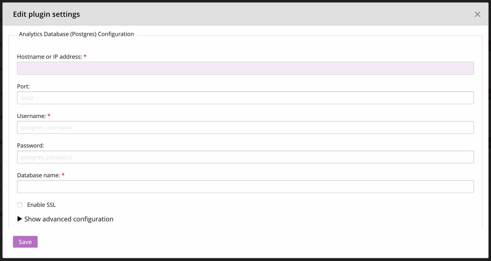
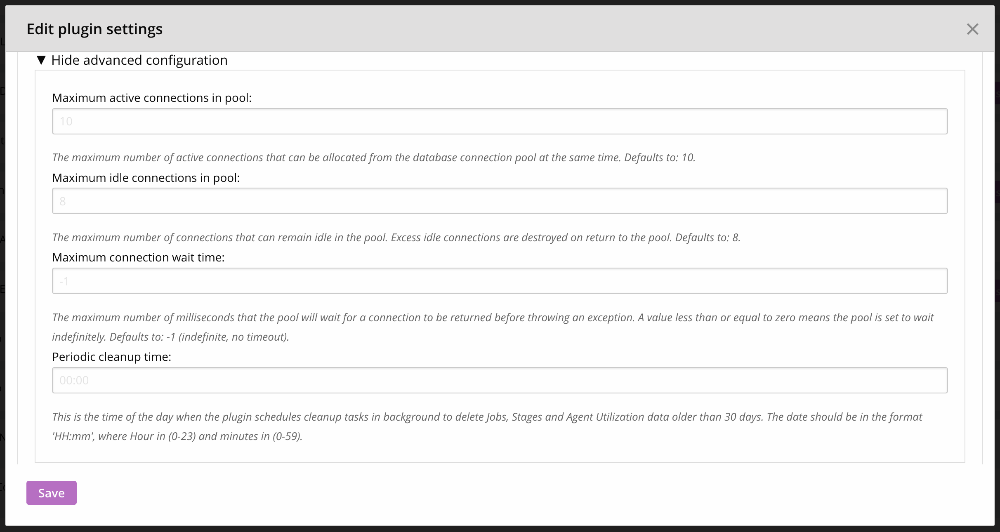
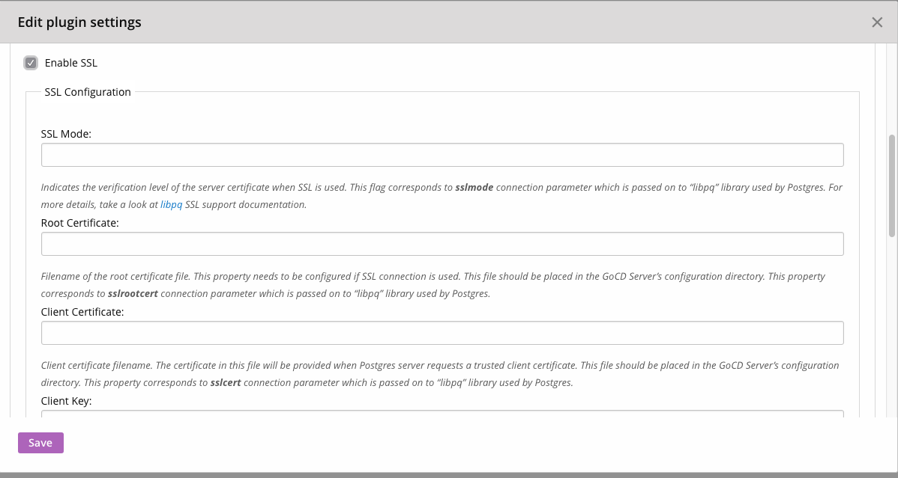

# GoCD Analytics Plugin

This plugin requires an **empty** PostgreSQL database for its data. If you are using the GoCD with PostgreSQL as the database backend, please note that the database schema that you use for analytics data should be separate from the schema used by GoCD. It is recommended that you use PostgreSQL versions 9.6 or later.

Once you've installed the plugin and started the GoCD server, you can provide it with the credentials of your PostgreSQL database. To do this:

1. Login to GoCD server as an admin and navigate to **_Admin_** _&gt;_ **_Plugins_** 

2. Find "GoCD Analytics Plugin" and click on the gear icon in that section to open the configuration page.

The configuration page looks like this:

Fill in the host, port, credentials, and database name of the PostgreSQL database schema mentioned earlier. Once you click "Save", the plugin will validate the settings and if it can connect to the database, it will allow the save operation to succeed.

### Advanced configuration:

It is also possible to set advanced configuration parameters in this section by clicking on "Show advanced configuration". The settings look like this:

The settings are:

1. **Maximum active connections in pool (Optional):** The plugin creates a connection pool for database access. This setting controls the number of active connections that it will hold. The default value of 10 does not need to be changed in normal circumstances.

2. **Maximum idle connections in pool (Optional):** The plugin creates a connection pool for database access. This setting controls the number of idle connections in that pool. The default value of 8 does not need to be changed in normal circumstances.

3. **Maximum connection wait time (Optional):** This is the amount of time (in *milliseconds*) that the pool will wait for the database to return a connection. The default value is -1, which represents "no timeout". It does not need to be changed in normal circumstances.

4. **Periodic cleanup time (Optional):** The plugin deletes granular data at job, stage, and agent utilization levels that are older than 30 days, so as to ensure that the performance continues to be dependable. This happens every day at the time defined by this setting. The default value is `00:00` (midnight).

### SSL configuration:
The plugin can be configured to enable secure communication between the plugin and the postgres database. To configure the plugin, click on the "Enable SSL" checkbox. The settings look like this:

1. **SSL Mode**: Indicates the verification level of the server certificate when SSL is used. This flag corresponds to the **sslmode** connection parameter which is passed on to `libpq` library used by Postgres. For more details, take a look at the [libpq](https://www.postgresql.org/docs/current/static/libpq-ssl.html#LIBPQ-SSL-PROTECTION) SSL support documentation.

2. **Root Certificate**: Absolute path to the root certificate file. This property needs to be configured if SSL connection is used. This file should be placed in the GoCD Server’s configuration directory. This property corresponds to the **sslrootcert** connection parameter which is passed on to PostgreSQL's `libpq` library.

3. **Client Certificate**: Absolute path to Client certificate file. The certificate in this file will be provided when Postgres server requests a trusted client certificate. This file should be placed in the GoCD Server’s configuration directory. This property corresponds to the **sslcert** connection parameter which is passed on to PostgreSQL's `libpq` library.

4. **Client Key**: Absolute path to RSA private key file for the client certificate. The key file should be placed in the GoCD Server’s configuration directory and must not allow any access to world or group (can be done using: `chmod 600 client.key`). This property corresponds to the **sslkey** connection parameters which is passed on to PostgreSQL's `libpq` library.

5. **Client PKCS8 Key**: Absolute path to PKCS8 encoded client key file. This should be placed in the GoCD Server’s configuration directory. This file is required for a successful connection to be established when trusted client certificates are used for authentication. OpenSSL can be used to create a PKCS8 encoded file from an RSA key file by executing `openssl pkcs8 -topk8 -outform DER -in client.key -nocrypt &gt; client_pkcs8.key`

The GoCD Server's config directory is usually `/etc/go` on Linux and `C:\Program Files(x86)\Go Server\config` on Windows. You can find the location of the GoCD Server installation [here](https://docs.gocd.org/current/installation/installing_go_server.html).

> Note: Ensure all the above files configured and placed in the GoCD Server's configuration directory can be read by 'go' user on Linux and the user account under which GoCD Server is running on Windows (usually LocalSystem account).

> **Note:** Once installed and configured, the plugin starts capturing metrics for events such as agent state change or a build trigger. Thus, you will have to wait for these events to occur before you can start seeing analytics data.
